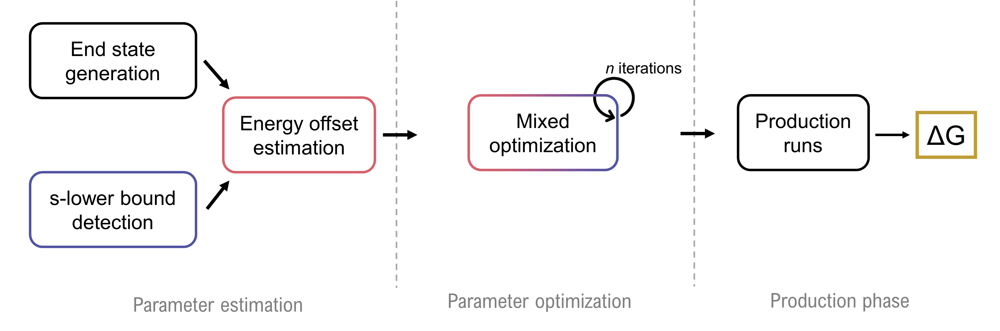

For each of the systems (FXA and GSK3b, for the ligands in solution and in complex), we provide the input topology and conformations 
used to perform the RE-EDS calculations. (The conformations correspond to the "SSM" conformations, the output of a_job_opt_states.py)

Anyone wanting to reproduce those results could copy one of the directories (e.g. /path/to/FXA/ligands and rename the directory 0_input)
Then the person would have to copy all python scripts found here, and adapt the global_definitions.py script to point to the correct .top, .ptp, .cnf
(here the file is pre-filled for GSK3b in complex)

example:

        project_dir/
                   0_input/xxx.top
                           xxx.cnf
                           xxx.ptp
                           (xxx_disres.dat)
                   global_definitions.py
                   0_job_emin.py
                   a_job_opt_states.py
                   b_job_lower_bound.py
                   c_job_eoff_estm.py
                   d_job_mixed_opt.py
                   e_job_production.py	   

Each of the steps of the RE-EDS pipeline may then be performed one after the other, starting with energy minimization, and continuing alphabetically
according to the first letter of the .py script. Certain options (i.e. simulation length, how to submit it to cluster, etc. can be directly changed in the scripts)

the ene_ana.md++.lib file tells gromos++ how the output files of the gromos simulations are formatted. Here, we provide the files we had used but
warn any potential user that using a different version of GROMOS to run the simulations might require changes in the ene_ana.md++.lib file for consistency
to make sure the correct fields are parsed when doing the analysis. 
